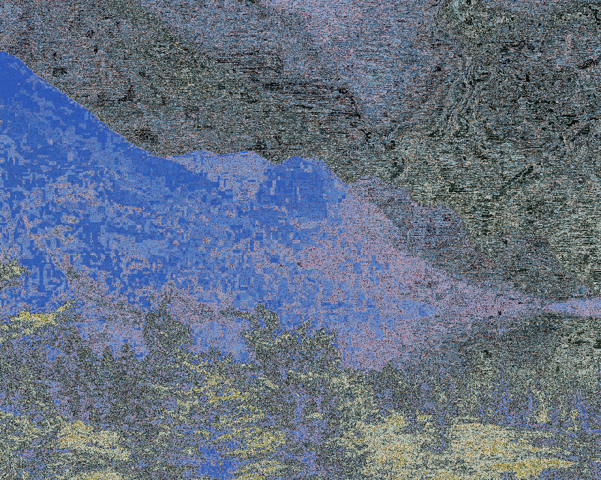

# Proj002-ColorTransfert

Raphaël TOURNAFOND & Ambroise DECOUTTERE - CMI info

## Description

Color transfer is an image processing application where you want 
to retarget the color histogram of an input image according to the 
color histogram of a target one.


## Work done

This program is able to transfer the colors of the source image onto 
the destination image.

The *opt_transport_v1* function simply takes the color of the closest projected 
pixel on the directionnal vector.

The *opt_transport_v2* function is more complex.
This function uses the directional vector to get the new color of each pixel by 
applying a part of this vector to the pixel to make it 
This function use the directionnal vector to get a new color more similar to the 
closest projected pixel but without using this pixel.


## Examples

Size of image used: 1024x1280

### opt_transport_v1 RGB

| Source  | Destination  | Result  | 
|---|---|---|
|   |   |   |
Time : 5.1 sec

### opt_transport_v1 Lab

| Source  | Destination  | Result  | 
|---|---|---|
|   |   |   |
Time : 2.6 sec

### opt_transport_v2 RGB

Iterations = 100 / Fraction of directional vector used = 0.1

| Source  | Destination  | Result  | 
|---|---|---|
|   |   |   |
Time : 37.4 sec

### opt_transport_v2 Lab

Iterations = 100 / Fraction of directional vector used = 0.1

| Source  | Destination  | Result  | 
|---|---|---|
|   |   |   |
Time : 43.4 sec

## Installation

First you need to get the file ```OPTransporter.py``` and put it in your project.

Then you can import it where you need it :
```python
from OPTransporter import OPTransporter
```

Finally you need to instantiate an OPTransporter object.
For example :
```py
ot = OPTransporter("pexelA-0.png", "pexelB-0.png", OPTransporter.RGB, True)
````

OPTransporter constructor

| Parameter  | Description  | 
|---|---|
| source_path | image path for the source (color) image |
| destination_path | image path for the destination (shape) image |
| use_lab | boolean defining if the lab color space is used (default : RGB) |
| verbose | boolean defining if the verbose mode should be used (default : False) |
